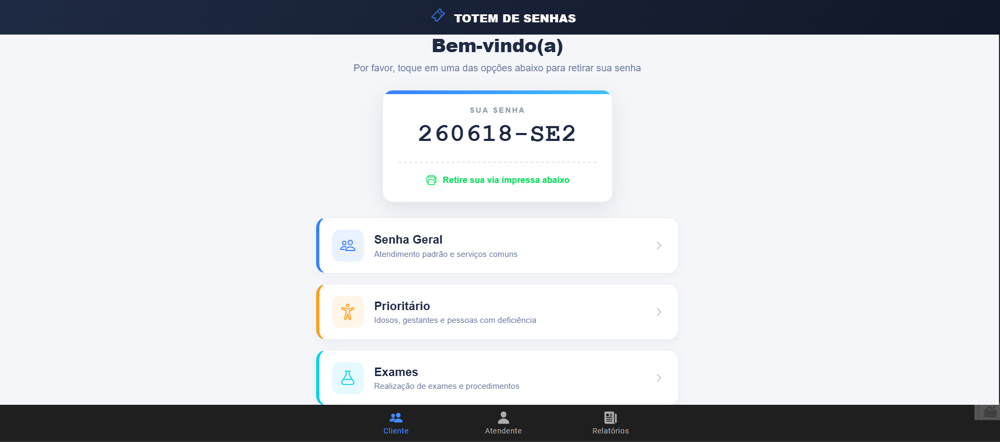

# 🎫 Totem de Senhas - Simulador de Filas de Atendimento



---

## 📖 A História do Projeto (Storytelling)

Imagine que você entra em uma clínica médica, um banco ou um órgão público movimentado. A primeira coisa que você faz é se dirigir a um totem eletrônico, pressionar um botão e retirar um papelzinho com sua senha. Minutos depois, uma tela sonora chama a sua senha e indica a mesa de atendimento. 

Essa dinâmica, tão comum no nosso cotidiano, é o resultado de uma engenharia de software focada em organização de processos e experiência do usuário. 

Este **Totem de Senhas** nasceu como um **projeto acadêmico** com um propósito claro: **compreender, modelar e simular na prática o funcionamento por trás desses sistemas de gerenciamento de filas.** Mais do que apenas linhas de código, este projeto representa a ponte entre os desafios de organização do mundo real e a solução lógica desenvolvida através da programação de computadores.

---

## 💡 Como Funciona? (Explicado de Forma Simples)

O sistema foi dividido em três partes intuitivas, simulando as três pontas de um atendimento real:

### 1. 🎫 Emissão de Senhas (O Cliente)
Quando o cliente chega ao totem, ele escolhe o tipo de atendimento que precisa:
*   **Geral (SG):** Atendimento padrão (consultas, informações gerais).
*   **Prioritário (SP):** Destinado a idosos, gestantes, pessoas com deficiência ou autistas, respeitando a legislação de prioridades.
*   **Exame (SE):** Um fluxo separado dedicado exclusivamente para quem vai realizar coletas ou exames clínicos.

Cada vez que um botão é clicado, uma **senha única** é gerada no formato `AAMMDD-TIPO#` (ex: `260618-SG1` - Senha Geral emitida em 18 de Junho de 2026, sendo a número 1 daquele dia).

### 2. 📢 Chamada de Senhas (O Atendente)
Em uma tela interna simulando o painel do operador, o atendente clica em **"Chamar Senha"**. O sistema calcula quem é a próxima pessoa da fila de forma justa e organizada e exibe a chamada na tela, mantendo também um histórico visível de todas as últimas senhas chamadas para evitar confusões.

### 3. 📊 Dashboard de Relatórios (O Administrador)
Para quem gerencia a clínica ou o estabelecimento, o sistema oferece um painel estatístico em tempo real indicando:
*   O volume total de atendimentos gerados.
*   O detalhamento por tipo de senha (quantas foram Geral, Prioritária ou Exame).
*   Isso ajuda os administradores a entenderem o perfil do público e otimizarem a quantidade de funcionários em cada setor.

---

## 🛠️ Tecnologias Utilizadas (E por que foram escolhidas)

Para construir essa simulação e torná-la rápida, moderna e capaz de rodar tanto no navegador quanto em celulares, escolhemos as seguintes ferramentas:

*   **[Angular (v16)](https://angular.io/):** O cérebro do projeto. Um framework desenvolvido pelo Google que nos permite organizar o código de forma modular, garantir que as atualizações na tela aconteçam instantaneamente (como nos painéis reais) e manter uma estrutura limpa e profissional.
*   **[Ionic Framework (v7)](https://ionicframework.com/):** A aparência do aplicativo. Ele fornece componentes visuais modernos, transições suaves e garante que o visual se adapte perfeitamente se você abrir no celular (iOS/Android) ou no computador.
*   **[TypeScript](https://www.typescriptlang.org/):** Garante mais segurança na escrita do código de programação, ajudando a evitar erros antes mesmo do sistema rodar.
*   **[Cordova SQLite Storage](https://github.com/storesafe/cordova-sqlite-storage):** Um banco de dados embutido configurado para salvar os atendimentos localmente no aparelho, simulando a persistência de dados.

---

## 🚀 Como Executar o Projeto Localmente

Siga o passo a passo simples abaixo para rodar o simulador no seu computador:

### Pré-requisitos
Certifique-se de ter instalado em seu computador:
1.  [Node.js](https://nodejs.org/) (versão 18 ou superior)
2.  Um terminal de sua preferência (Prompt de Comando, PowerShell ou Terminal Git)

---

### Passo 1: Clonar e Acessar o Projeto
Abra o seu terminal na pasta do projeto e certifique-se de estar na pasta que contém o arquivo `package.json`:
```bash
cd totem
```

### Passo 2: Instalar as Dependências
Baixe todas as bibliotecas necessárias para rodar o projeto executando:
```bash
npm install
```

### Passo 3: Iniciar o Servidor de Desenvolvimento
Inicie o aplicativo com o comando:
```bash
npm start
```

### Passo 4: Acessar no Navegador
Uma janela deverá abrir automaticamente. Caso não abra, acesse pelo navegador o endereço:
**[http://localhost:4200](http://localhost:4200)**

Pronto! Agora você pode simular a emissão, chamada e visualizar os relatórios em tempo real.

---

## 🏗️ Estrutura do Código Principal
Se você é desenvolvedor e quer entender como a lógica está organizada, veja os principais arquivos:
*   [senhas.service.ts](totem/src/app/services/senhas.service.ts): Centraliza toda a regra de negócio do gerenciamento de senhas (fila de espera, contadores e geração do código único).
*   [tab1.page.ts / html](totem/src/app/tab1/): Controla a interface do Totem de Emissão.
*   [tab2.page.ts / html](totem/src/app/tab2/): Controla a interface da Painel de Chamadas.
*   [tab3.page.ts / html](totem/src/app/tab3/): Controla a exibição dos Relatórios.

---

*Projeto desenvolvido com fins educacionais para consolidação de conceitos de desenvolvimento web moderno e lógica de controle de filas.*
